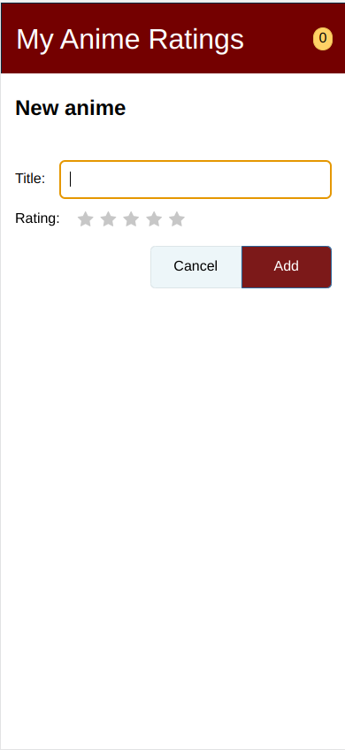

### Aplicação: My Anime List
### Autor: Matheus Duarte de Carvalho

Essa aplicação tem o objetivo de montar uma lista de animes onde os mesmo podem ser rankiados pelo usuário.

Essa é a tela inicial da aplicação: 

É possível ver que na tela inicial temos 3 botões. Um de adicionar, que nos leva a tela de cadastro:

Ao adicionar registros na tela de cadastro, conseguimos usar o botão de ordenação, que ordena a lista pelo ranking.

Essa é a cara da tela com dados:

Quando temos registros também é possível editar as informações dos mesmos, na tela de update:

E por fim temos a opção de filtrar os animes pelo título.

A aplicação armazena apenas o nome do anime o sua classificação.

O código não possui comentários, mas os métodos tem nomes claros.

A aplicação funciona corretamente.

A aplicação não está completa pois apenas armazenei dados simples como strings ou inteiros. Isso foi devido a falta de tempo que eu tive para dedicar ao trabalho. Eu gostaria de fazer melhor, mas infelizmente foi um período de muitas provas e trabalhos, além disso eu também trabalho durante o dia, então meu tempo foi reduzido.

